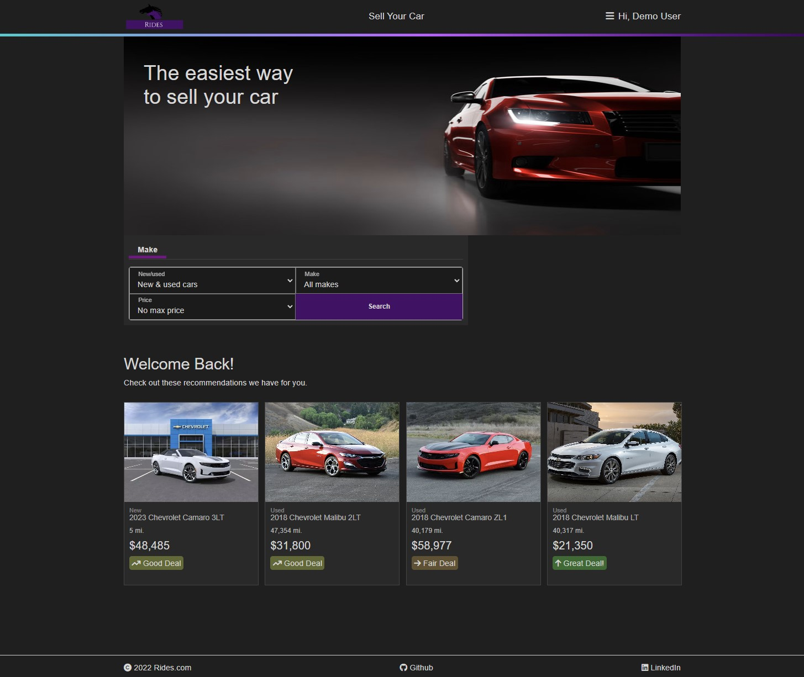
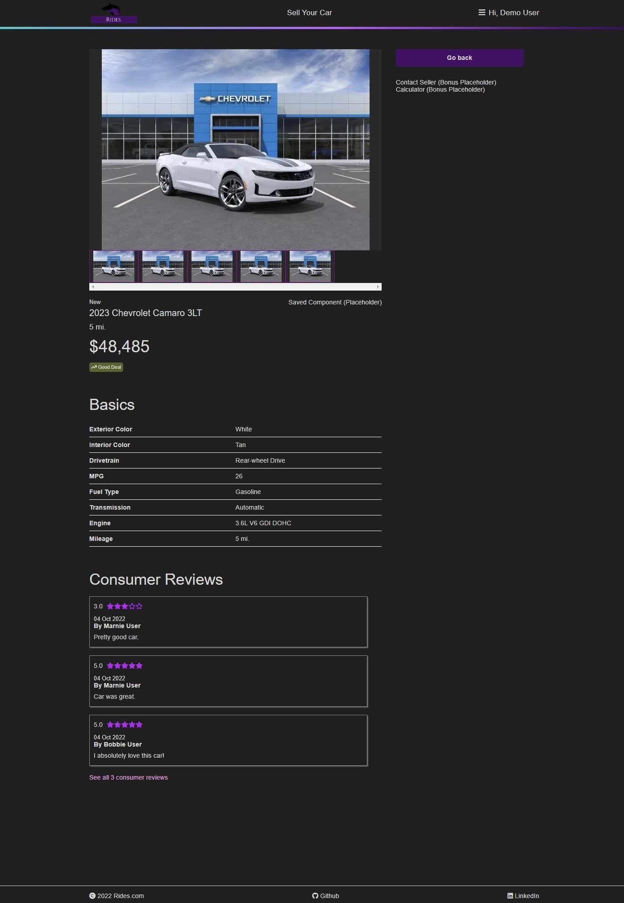
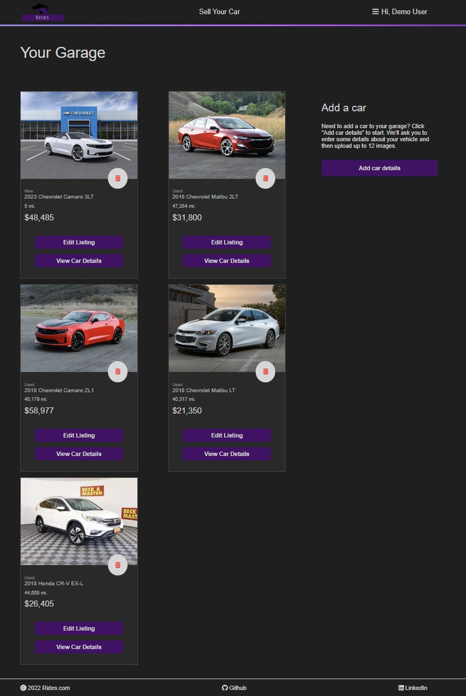

# Rides

## About

[Rides](https://rides1.herokuapp.com/) is a full-stack application clone of Cars.com deployed on Heroku.  The app uses JavaScript, React, and Redux on the front-end as well as Python, Flask, and SQLAlchemy on the back-end.

### Features of App
* User Authentication required in order for users to be logged in to access certain features.
* Full CRUD features for Creating, Reading, Updating and Deleting of Cars.
* Full CRUD features for Creating, Reading, Updating and Deleting of Reviews on Cars.

 

## Technologies Used

### Front-end:
* Javascript
* React
* Redux
* Node.js
* HTML
* CSS

### Back-end:
* Python
* Flask
* SQLAlchemy
* WTForms
* PostgresSQL

 

## Application Preview

### Landing Page:

 

### Car Details:

 

### Your Garage:

 

## How to Launch

### Heroku
Feel free to explore the site on Heroku using this [Link](https://rides1.herokuapp.com/).

### Locally
If you would like to launch the site locally please do the following:

1. Clone this repo using a terminal by going to a directory where you would like to download and typing `git clone https://github.com/Pepa90210/Rides.git`.
* Alternatively, you may download the zip file and extract it to a folder on your computer.

2. Create a .env in your 'root' directory and copy paste eveything inside .env.example.

3. Still in your 'root' directory, open a terminal and type `pipenv install -r requirements.txt`.

4. You will then want to enter your virtual environment by typing `pipenv shell`.

5. Still in your 'root' directory, load the migrations database using `flask db upgrade`.

6. Still in you 'root' directory, load the seed data into your database using `flask seed all`.

7. Type `flask run` to start your backend.

8. Open up a second terminal, go into the 'frontend' directory called `react-app` and in the terminal type `npm install`.  Then type `npm start`.  If you have Google Chrome, this should automatically launch the browser and direct you to `localhost:3000`.  If it did not launch automatically, manually open up a browser and go to `localhost:3000`.

9. Congrats, you have launched the app.
